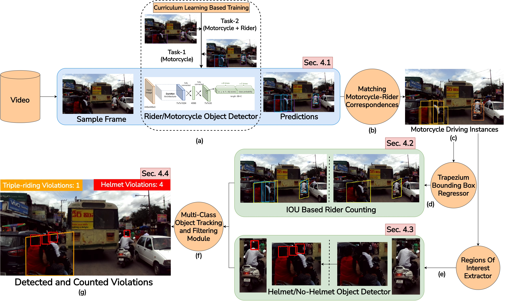

# Detecting, Tracking and Counting Motorcycle Rider Traffic Violations on Unconstrained Roads
[](LICENSE)
[](https://colab.research.google.com/drive/1kIUNBpGWHc8eLSoLSU1Jx7kJza16A9xo#scrollTo=mfSnq1KmGSor)


Motorcycle Violation detection, tracking and counting implemented with YOLOv4, Curriculum-learning based model training, Trapezium-shaped bounding box approach, DeepSort, and TensorFlow. Our work proposes the use of camera mounted on vehicle to jointly track triple-riding and helmet violations on crowded asian streets.We also demonstrate the effectiveness of using curriculum learning for motorcycle violations and trapezium bounding boxes instead of conventional rectangular boxes. Our work lays the foundation for utilizing such systems for increased road safety. It can be used for surveillance in any corner of the city without any huge cost of a static camera network. In the future, we wish to explore the possibility of deploying our system to a distributed GPU setup for city-wide surveillance.

## Demo of Detecting, Tracking and Counting Motorcycle Violations
<p align="center"></p>

## Framework of Detecting, Tracking and Counting Motorcycle Violations
<p align="center"></p>

## Getting Started
To get started, install the proper dependencies either via Anaconda or Pip. I recommend Anaconda route for people using a GPU as it configures CUDA toolkit version for you.

### Conda (Recommended)

```bash
# Tensorflow CPU
conda env create -f conda-cpu.yml
conda activate yolov4-cpu

# Tensorflow GPU
conda env create -f conda-gpu.yml
conda activate yolov4-gpu
```

### Pip (or if you get any tensorflow version error with pip packages in conda command, load conda environment and continue with following command)
(TensorFlow 2 packages require a pip version >19.0.)
```bash
pip install -r requirements.txt

```
### Nvidia Driver (For GPU, if you are not using Conda Environment and haven't set up CUDA yet)
Make sure to use CUDA version 11.2 as it is the proper version for the TensorFlow version used in this repository.
https://developer.nvidia.com/cuda-11.2.0-download-archive

## Downloading the proposed YOLOv4 Pre-trained Weights
Our object tracker uses YOLOv4 to make the object detections, which deep sort then uses to track. There are 2 YOLOv4 models that we use:
1. Curriculum-Learning based 2 class object detector for motorcycle and rider [[Download](https://drive.google.com/file/d/1CEsjntvPCK5vm77dDf0SBOaVb9pihDUg/view?usp=sharing)]
2. Conventional YOLOv4 2 class object detector for helmet and no-helmet [[Download](https://drive.google.com/file/d/1rzH7WDmwcZTvg1onqcYav0q0x6L1VRp9/view?usp=sharing)]

## Downloading the proposed trapezium bounding box Weights
Our triple-riding violation detection takes use of trapezium shaped instance boxes to associate a rider with it's motorcycle and eventually find a violation. The weight we used are:
1. MLP regressor weights to create a trapezium-shaped bounding box [[Download](https://drive.google.com/file/d/1QZhALEziZ9lkS3F8GGz9OdKG12oQ2u7o/view?usp=sharing)]

Copy and paste Trapezium_Prediction_Weights.pickle from your downloads folder into the 'data' folder of this repository as Trapezium_Prediction_Weights.pickle
## Setup the tracker
```bash
# clone repository for violation tracking
git clone https://github.com/iHubData-Mobility/public-motorcycle-violations.git

# step into the triple-riding violations folder
cd public-motorcycle-violations/

# uncomment below line ONLY if you run into any dependency issues while following tutorial
pip install -r requirements.txt

cd data/
gdown --id 1CEsjntvPCK5vm77dDf0SBOaVb9pihDUg
gdown --id 1rzH7WDmwcZTvg1onqcYav0q0x6L1VRp9
cd ..

python save_model.py --weights ./data/R_M_v4_CL.weights --output ./checkpoints/yolov4-416_L4 --classes ./data/classes/R_M.names
python save_model.py --weights ./data/H_NH_v4_nonCL.weights --output ./checkpoints/yolov4-416-FG --classes  ./data/classes/H_NH.names
```
## Running the Tracker with YOLOv4
To implement the object tracking using YOLOv4, first we convert the .weights into the corresponding TensorFlow model which will be saved to a checkpoints folder. Then all we need to do is run the object_tracker.py script to run our object tracker with YOLOv4, DeepSort and TensorFlow.
```bash
# run DeepSort with YOLOv4 Object Detections as backbone (enable --info flag to see info about tracked objects)
python run.py --video ./data/video/3idiots.mp4 --output ./outputs/3idiots.mp4  --dont_show

```
The output flag allows you to save the resulting video of the object tracker running so that you can view it again later. Video will be saved to the path that you set. (outputs folder is where it will be if you run the above command!)

The detec_to_vid.py allows you to show in the final screen a much cleaner video of selected objects and their counts (For instance: Helmet Violation (Red), Triple-riding violation (orange))

If you want to run yolov3 set the model flag to ``--model yolov3``, upload the yolov3.weights to the 'data' folder and adjust the weights flag in above commands. (see all the available command line flags and descriptions of them in a below section)

## Running the Tracker with YOLOv4-Tiny
The following commands will allow you to run yolov4-tiny model. Yolov4-tiny allows you to obtain a higher speed (FPS) for the tracker at a slight cost to accuracy. Make sure that you have downloaded the tiny weights file and added it to the 'data' folder in order for commands to work!
```
# save yolov4-tiny model
python save_model.py --weights ./data/yolov4-tiny.weights --output ./checkpoints/yolov4-tiny-416 --model yolov4 --tiny

# Run yolov4-tiny object tracker
python object_tracker.py --weights ./checkpoints/yolov4-tiny-416 --model yolov4 --video ./data/video/test.mp4 --output ./outputs/tiny.avi --tiny
```

## Resulting Video
As mentioned above, the raw output video will save to wherever you set the ``--output`` command line flag path to. I always set it to save to the 'outputs' folder. And, further you can create a self-adjusted video output using ``--detections`` and save the video using ``--output`` in detec_to_vid.py . You can also change the type of video saved by adjusting the ``--output_format`` flag, by default it is set to AVI codec which is XVID.

Example video showing tracking:
<p align="center"></p>


## Command Line Args Reference

```bash
save_model.py:
  --weights: path to weights file
    (default: './data/yolov4.weights')
  --output: path to output
    (default: './checkpoints/yolov4-416')
  --[no]tiny: yolov4 or yolov4-tiny
    (default: 'False')
  --input_size: define input size of export model
    (default: 416)
  --framework: what framework to use (tf, trt, tflite)
    (default: tf)
  --model: yolov3 or yolov4
    (default: yolov4)
    
 run.py:
  --video: path to input video (use 0 for webcam)
    (default: './data/video/test.mp4')
  --output: path to output video (remember to set right codec for given format. e.g. XVID for .avi)
    (default: None)
  --output_format: codec used in VideoWriter when saving video to file
    (default: 'XVID)
  --[no]tiny: yolov4 or yolov4-tiny
    (default: 'false')
  --weights_L4: path to weights file
    (default: './checkpoints/yolov4-416_L4')
  --weights_RHNH: path to weights file
    (default: './checkpoints/yolov4-416-FG')
  --rider_pred_threshold: IOU/NIOU area threshold
    (default: 1.5)
  --trapezium_pred_model: add the model weights for predicting trapezium bounding box as a post-processing step
    (default: './data/Trapezium_Prediction_Weights.pickle')
  --framework: what framework to use (tf, trt, tflite)
    (default: tf)
  --model: yolov3 or yolov4
    (default: yolov4)
  --size: resize images to
    (default: 416)
  --iou: iou threshold
    (default: 0.45)
  --score: confidence threshold
    (default: 0.50)
  --dont_show: dont show video output
    (default: False)
  --info: print detailed info about tracked objects
    (default: False)
    
 detec_to_vid.py:
  --video: path to input video (use 0 for webcam)
    (default: './data/video/test.mp4')
  --detections: path to detections file(.csv) for the video
    (default: './outputs/detections/detections_2019-07-19-13-01-17_1_interpolated.csv')
  --output: path to final output video
    (default: './outputs/detections/2019-07-19-13-01-17_1.mp4')
```

### References  

   Huge shoutout goes to theAIGuysCode, hunglc007 and nwojke as their repositories guided us in creating our codebase:
  * [yolov4-deepsort](https://github.com/theAIGuysCode/yolov4-deepsort)
  * [tensorflow-yolov4-tflite](https://github.com/hunglc007/tensorflow-yolov4-tflite)
  * [Deep SORT Repository](https://github.com/nwojke/deep_sort)
